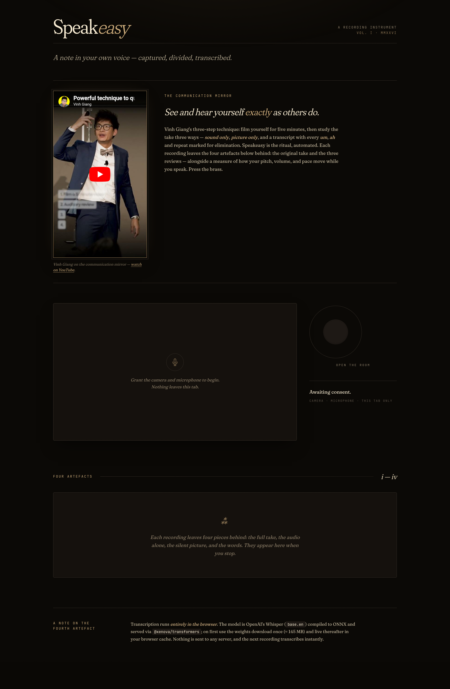

# Speakeasy

> **Live:** <https://nvme-git.github.io/speakeasy/>

A recording instrument. Capture a take, divide it into four artefacts (full / audio / silent footage / words), then read the audio's pitch, volume, and pace plotted over time.

Built around two pieces of advice from speaking coach Vinh Giang:

1. **The [_communication mirror_](https://youtube.com/shorts/mXPIJosPsVU)** — film yourself, then review the take three separate ways (sound only, picture only, transcript with filler words highlighted) so you see and hear yourself exactly as others do.
2. **The [_vocal toolbox_](https://www.youtube.com/watch?v=6fHoN6MR6MI)** — speed, pitch, volume, and pause are the four tools that turn a flat voice into a full one.

Speakeasy turns the first into a single click (the four artefacts) and the second into a chart (the analysis view, which measures three of the four — pitch, volume, pace — with the fourth showing up as the gaps between them).

Single-file web app. No bundler, no dependencies you have to install — just open it.



## Run it

`getUserMedia` requires a secure context, so it won't run from `file://` in every browser. The simplest path:

```bash
cd ~/Work/SpeakEasy
python3 -m http.server 8000
```

Then open <http://localhost:8000> and grant camera + microphone access.

The first time you stop a recording, your browser downloads the Whisper `base.en` weights (≈ 145 MB). It caches them, so every subsequent recording transcribes instantly.

## What it does

1. **Open the room** — requests camera + microphone.
2. **Record** — three `MediaRecorder`s run in parallel on different track subsets:
   - one on the full stream (video + audio),
   - one on a `MediaStream` of just the audio tracks,
   - one on a `MediaStream` of just the video tracks.
   A live audio meter rendered to canvas via `AnalyserNode` shows you that the microphone is alive.
3. **Stop** — flushes all three recorders, then:
   - downloads the three media artefacts to your default Downloads folder,
   - decodes the audio to 16 kHz mono Float32 PCM,
   - runs **Whisper `base.en`** in-browser (via `@xenova/transformers`, ONNX Runtime under the hood) with word-level timestamps,
   - downloads the transcript as the fourth artefact,
   - computes pitch (autocorrelation), volume (RMS dB), and pace (words/min in a 3-second sliding window) on the same buffer,
   - renders the analysis as three small multiples sharing a time axis.

Files are named `speakeasy-<timestamp>-{full,audio,video,text}.{webm|m4a|mp4|txt}` — the timestamp is shared so they sort together.

## The analysis view

Three rows, shared time axis, brass on coal:

- **Pitch (Hz)** — fundamental frequency from autocorrelation, clamped to the voice band (50–400 Hz). Single-frame dropouts inside speech are smoothed back into the line.
- **Volume (dB)** — RMS amplitude of each 64 ms window converted to decibels full scale.
- **Pace (wpm)** — Whisper's word timestamps, counted in a 3 s window centred on each sample point.

Where you were silent — anywhere the audio falls below −45 dB — the line **breaks** and a faint band shades that span. Speaking is brass; silence is a gap.

## Hosting

Speakeasy is a single static HTML file with no build step, so it runs on any plain static host. **GitHub Pages works out of the box** — `getUserMedia` only requires a secure context, which Pages serves over HTTPS by default. The Whisper model is fetched from `cdn.jsdelivr.net` and cached in your browser; no server-side anything.

This repo's Pages site is enabled on `main` at the root: <https://nvme-git.github.io/speakeasy/>. To enable it elsewhere:

```bash
gh api -X POST repos/<owner>/<repo>/pages \
  -f "source[branch]=main" \
  -f "source[path]=/"
```

Other zero-config hosts that work the same way: Cloudflare Pages, Netlify, Vercel (treat it as a static site), Surge, or just a `python3 -m http.server` on your laptop.

## Privacy

Nothing leaves your machine. Camera, microphone, transcription, and analysis all run client-side. The Whisper weights live in your browser's cache; clear it to evict them.

## Implementation notes

- `MediaRecorder` × 3 on different `MediaStream` views avoids a separate demux step.
- Whisper word timestamps come from `pipeline('automatic-speech-recognition', 'Xenova/whisper-base.en')` with `return_timestamps: 'word'`.
- Pitch detection uses a normalized autocorrelation over lags 40–320 samples, with an octave-error guard (prefer the lowest lag whose correlation is within 95 % of the peak).
- Charts render to `<canvas>` at devicePixelRatio for sharpness; resize listener redraws on display change.
